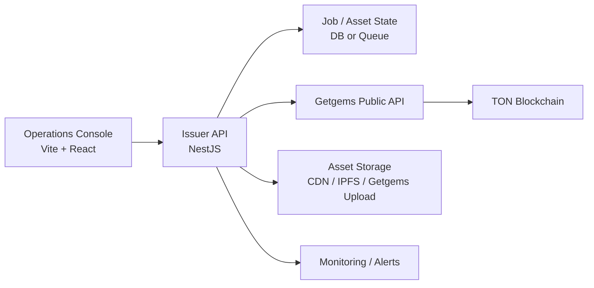

# Getgems TON NFT Issuance Guide

## Objective

Use the Getgems Public API to create and operate a TON NFT issuance system without sending minting transactions directly from the application layer.

## Recommended System Architecture



## Core Principles

- Keep the Getgems `Authorization` token on the backend only.
- Persist every `requestId` and enforce uniqueness for idempotent minting.
- Use background polling for `in_queue` and `minting` statuses.
- Keep collection cover assets on your own HTTPS storage for the first collection bootstrap.
- Validate all minting logic on testnet before switching to mainnet.
- Use `NETWORK` as the backend default, but allow a per-request `network` override for operator workflows.

## Network Configuration

Recommended backend env variables:

- `NETWORK=mainnet`
- `GETGEMS_MAINNET_API_BASE_URL=https://api.getgems.io/public-api`
- `GETGEMS_TESTNET_API_BASE_URL=https://api.testnet.getgems.io/public-api`
- `GETGEMS_MAINNET_API_KEY=...`
- `GETGEMS_TESTNET_API_KEY=...`

Recommended frontend env variables:

- `VITE_DEFAULT_NETWORK=mainnet`
- `VITE_ENABLED_NETWORKS=mainnet,testnet`

Resulting behavior in this workspace:

- Backend uses `NETWORK` when no query override is provided.
- Frontend initializes the selector from `VITE_DEFAULT_NETWORK`.
- Requests can target a specific network with `?network=mainnet` or `?network=testnet`.

## End-to-End Flow

### 1. Enable API Access

Getgems provides **separate** API key portals for testnet and mainnet. You must apply for each independently.

#### Testnet API Key (recommended first step)

1. Open the **Testnet Public API portal**: [https://testnet.getgems.io/public-api](https://testnet.getgems.io/public-api)
2. Click **Connect Wallet** and sign in with a TON-compatible wallet (Tonkeeper, MyTonWallet, etc.) on the **testnet** network.
3. After connecting, follow the on-screen instructions to generate an API key.
4. Copy the key and store it as `GETGEMS_TESTNET_API_KEY` in your backend `.env`.
5. Top up the dedicated Getgems minting wallet (shown after login) with **testnet TON** to cover gas fees. You can get testnet TON from the [TON Testnet Faucet](https://t.me/testgiver_ton_bot).

#### Mainnet API Key

1. Open the **Mainnet Public API portal**: [https://getgems.io/public-api](https://getgems.io/public-api)
2. Click **Connect Wallet** and sign in with a TON-compatible wallet on the **mainnet** network.
3. After connecting, follow the on-screen instructions to generate an API key.
4. Copy the key and store it as `GETGEMS_MAINNET_API_KEY` in your backend `.env`.
5. Top up the dedicated Getgems minting wallet with **real TON** to cover gas fees.

#### Accessing the API Documentation

Each portal has a "Documentation" button in the top-right corner, or you can visit the Swagger UI directly:

- **Mainnet**: [https://api.getgems.io/public-api/docs](https://api.getgems.io/public-api/docs)
- **Testnet**: [https://api.testnet.getgems.io/public-api/docs](https://api.testnet.getgems.io/public-api/docs)

#### Using the API Key

Include the API key in every request via the `Authorization` header:

```bash
curl -X 'GET' \
  'https://api.getgems.io/public-api/minting/{collectionAddress}/{requestId}' \
  -H 'accept: application/json' \
  -H 'Authorization: {YOUR_API_KEY}'
```

> **Important**: Always validate your full workflow on **testnet** before moving to mainnet.

### 2. Prepare Collection Metadata

Collection metadata fields supported by Getgems:

- `name`
- `description`
- `image`
- `external_link`
- `social_links`
- `cover_image`

Recommendation:

- Store the first collection `image` and `cover_image` on your own HTTPS CDN or IPFS.
- After a collection exists, use Getgems upload credentials for item assets when helpful.

### 3. Create a Collection

Getgems exposes `POST /minting/{collectionAddress}/new-collection`.

Practical note:

- The endpoint exists in the official OpenAPI schema.
- The official markdown guide focuses more on item minting than collection bootstrap.
- Treat the path `collectionAddress` as an existing minting context/template until fully validated in your flow.
- Test this step on [testnet](https://api.testnet.getgems.io/public-api/docs) first, and confirm with [getgemstech](https://t.me/getgemstech) if your launch process depends on it.

### 4. Upload Assets

Use `POST /minting/create-upload/{collectionAddress}/{fileName}` to obtain:

- `uploadUrl`
- `keyPrefix`
- `urlPrefix`
- `formFields`

Supported file types from the current official schema:

- `jpg`
- `png`
- `gif`
- `mp4`
- `json`
- `webp`

### 5. Mint NFTs

Single mint:

- `POST /minting/{collectionAddress}`

Batch mint:

- `POST /minting/{collectionAddress}/batch`

Each NFT should include:

- `requestId`
- `ownerAddress`
- `name`
- `description`
- `image`

Optional fields:

- `content_url`
- `lottie`
- `attributes`
- `buttons`
- `index`

### 6. Poll Status

Use `GET /minting/{collectionAddress}/{requestId}`.

Observed official statuses:

- `just_created`
- `in_queue`
- `minting`
- `ready`
- `problem`

Operational guidance:

- Poll no more often than every 6 seconds.
- Retry timeouts or transient `500` errors with the same `requestId`.

### 7. Operate and Maintain

Useful endpoints:

- `GET /minting/{collectionAddress}/wallet-balance`
- `GET /minting/{collectionAddress}/list`
- `POST /minting/{collectionAddress}/update-collection`
- `POST /minting/{collectionAddress}/update/{nftAddress}`
- `POST /minting/{collectionAddress}/refund/{receiverAddress}`
- `GET /nft/collection/items/{collectionAddress}`
- `GET /nft/collection/by-address/{collectionAddress}/{nftAddress}`

## Backend Responsibilities

The NestJS service in this workspace is designed to own:

- API key storage
- Getgems request signing
- DTO validation
- Minting orchestration
- Error normalization
- Health checks

Recommended future additions:

- PostgreSQL tables for mint jobs, assets, collections, and polling history
- Queue workers for batch minting
- Webhook or scheduled polling
- Role-based admin authentication
- Audit trail for metadata changes

## Suggested Data Model

Minimal tables worth adding next:

- `collections`
- `nft_assets`
- `mint_jobs`
- `mint_job_items`
- `mint_status_events`

Key fields:

- `request_id`
- `collection_address`
- `nft_address`
- `owner_address`
- `status`
- `payload`
- `error_message`
- `getgems_url`

## API Mapping In This Workspace

Frontend talks to the NestJS backend, not directly to Getgems.

NestJS routes included in this starter:

- `GET /api/health?network=testnet`
- `POST /api/minting/templates/:collectionAddress/collections?network=mainnet`
- `GET /api/minting/templates/:collectionAddress/collections/:requestId?network=testnet`
- `POST /api/minting/collections/:collectionAddress/upload-credentials?network=mainnet`
- `POST /api/minting/collections/:collectionAddress/items?network=testnet`
- `POST /api/minting/collections/:collectionAddress/items/batch?network=mainnet`
- `GET /api/minting/collections/:collectionAddress/requests/:requestId?network=testnet`
- `GET /api/minting/collections/:collectionAddress/tasks?network=mainnet`
- `GET /api/minting/collections/:collectionAddress/wallet-balance?network=testnet`
- `POST /api/minting/collections/:collectionAddress/metadata?network=mainnet`
- `POST /api/minting/collections/:collectionAddress/items/:nftAddress/metadata?network=testnet`

## Risks To Check Before Launch

- Collection bootstrap flow around `new-collection` should be validated on testnet.
- The mint wallet must always have enough TON for gas.
- Asset URLs should remain stable to avoid metadata drift.
- Bulk mint batches should be rate-limited to stay under the official IP quota.
- cNFT should only be used when your collection size and product design justify it.

## Official Links

- **Getgems Mainnet API Key Portal**: [https://getgems.io/public-api](https://getgems.io/public-api)
- **Getgems Testnet API Key Portal**: [https://testnet.getgems.io/public-api](https://testnet.getgems.io/public-api)
- Getgems Public API UI: [https://api.getgems.io/public-api/docs](https://api.getgems.io/public-api/docs)
- Getgems Public API schema: [https://api.getgems.io/public-api/docs.json](https://api.getgems.io/public-api/docs.json)
- Getgems testnet API UI: [https://api.testnet.getgems.io/public-api/docs](https://api.testnet.getgems.io/public-api/docs)
- Getgems minting guide: [https://github.com/getgems-io/nft-contracts/blob/main/docs/minting-api-en.md](https://github.com/getgems-io/nft-contracts/blob/main/docs/minting-api-en.md)
- Getgems read API guide: [https://github.com/getgems-io/nft-contracts/blob/main/docs/read-api-en.md](https://github.com/getgems-io/nft-contracts/blob/main/docs/read-api-en.md)
- Getgems metadata field guide: [https://github.com/getgems-io/nft-contracts/blob/main/docs/metadata.md](https://github.com/getgems-io/nft-contracts/blob/main/docs/metadata.md)
- Getgems contracts repo: [https://github.com/getgems-io/nft-contracts](https://github.com/getgems-io/nft-contracts)
- TON metadata standard: [https://docs.ton.org/standard/tokens/metadata](https://docs.ton.org/standard/tokens/metadata)
- TON compressed NFT guide: [https://docs.ton.org/v3/guidelines/dapps/asset-processing/compressed-nfts](https://docs.ton.org/v3/guidelines/dapps/asset-processing/compressed-nfts)
- Getgems tech chat: [https://t.me/getgemstech](https://t.me/getgemstech)
- Getgems support bot: [https://t.me/nfton_bot](https://t.me/nfton_bot)
