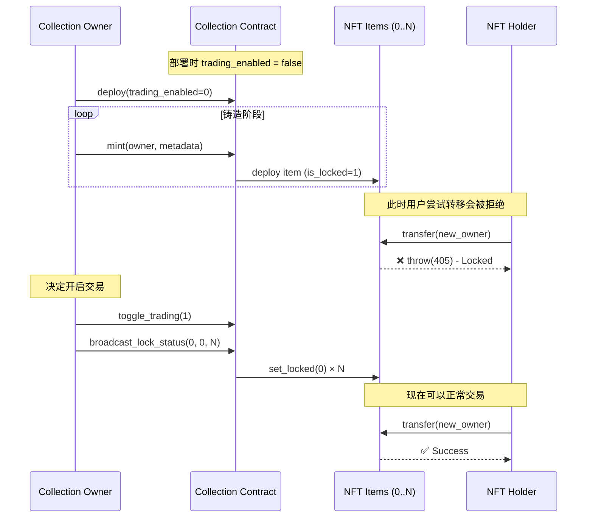

# NFT Collection Trading Lock / Unlock 方案

## 需求

NFT Collection 发行后默认不可交易（转移），由 Collection Owner 手动"开启交易"后方可交易。未开启期间任何 `transfer` 操作均被合约拒绝。

## 标准现状

| 标准 | 是否原生支持交易锁定 |
|------|---------------------|
| TEP-62 (NFT Standard) | ❌ 不支持，mint 即可转移 |
| TEP-85 (SBT Standard) | 部分 — 灵魂绑定代币完全不可转移，但无"可切换"概念 |
| GetGems Minting API | ❌ 使用标准合约，不支持自定义逻辑 |

**结论**：必须自行编写和部署自定义智能合约。

---

## 方案对比

| 方案 | 复杂度 | 优点 | 缺点 |
|------|--------|------|------|
| **A. Item 级锁定** | ⭐⭐ | 简单直观，每个 item 独立控制 | 解锁需逐个发消息，collection 大时 gas 高 |
| **B. Collection 级锁定** | ⭐⭐⭐ | 一次操作即可控制全部 item | TON 异步架构需两次消息往返，gas 更高 |
| **C. 混合方案（推荐）** | ⭐⭐ | item 内维护 locked 标志，collection 广播解锁 | 需要批量广播逻辑 |

---

## 推荐方案：混合方案（C）

### 架构概览

```
Collection Owner
      │
      ▼  op::toggle_trading (解锁/锁定)
┌─────────────────┐
│ Custom Collection│  ← 存储 trading_enabled 状态
│   Contract       │
└────────┬────────┘
         │  op::set_locked (广播给所有 item)
         ▼
┌─────────────────┐  ┌─────────────────┐  ┌─────────────────┐
│ Custom Item #0  │  │ Custom Item #1  │  │ Custom Item #N  │
│ is_locked = 0/1 │  │ is_locked = 0/1 │  │ is_locked = 0/1 │
└─────────────────┘  └─────────────────┘  └─────────────────┘
         │
         ▼  op::transfer → 检查 is_locked
   允许 / 拒绝(405)
```

### 工作流

1. **部署 Collection** — `trading_enabled = false`，所有新 mint 的 item 默认 `is_locked = true`
2. **Mint NFT** — item 合约初始化时读取 collection 的锁定状态
3. **开启交易** — Owner 调用 Collection 合约的 `toggle_trading`，Collection 向所有 item 广播 `set_locked(false)`
4. **关闭交易**（可选） — 同理广播 `set_locked(true)` 重新锁定

---

## 智能合约实现

### 1. 自定义 nft-item.fc

基于 [ton-blockchain/token-contract](https://github.com/ton-blockchain/token-contract) 的 `nft-item.fc` 修改。

#### 1.1 Storage Layout 变更

```func
;; 原始字段
;; int init?
;; int index
;; slice collection_address
;; slice owner_address
;; cell content

;; ===== 新增字段 =====
;; int is_locked   ;; 1 = 锁定（不可转移）, 0 = 解锁（可转移）

(int, int, slice, slice, cell, int) load_data() {
    slice ds = get_data().begin_parse();
    var (init?, index) = (ds~load_uint(1), ds~load_uint(64));
    if (init?) {
        var owner_address = ds~load_msg_addr();
        var collection_address = ds~load_msg_addr();
        var content = ds~load_ref();
        var is_locked = ds~load_uint(1);       ;; 新增
        return (init?, index, collection_address, owner_address, content, is_locked);
    }
    return (init?, index, null(), null(), null(), 1);  ;; 默认锁定
}

() store_data(int index, slice collection_address, slice owner_address, cell content, int is_locked) impure {
    set_data(
        begin_cell()
            .store_uint(1, 1)                  ;; init? = true
            .store_uint(index, 64)
            .store_slice(owner_address)
            .store_slice(collection_address)
            .store_ref(content)
            .store_uint(is_locked, 1)          ;; 新增
        .end_cell()
    );
}
```

#### 1.2 新增 Opcodes

```func
;; op-codes.fc
const int op::transfer          = 0x5fcc3d14;   ;; TEP-62 标准
const int op::get_static_data   = 0x2fcb26a2;   ;; TEP-62 标准
const int op::set_locked        = 0x1d4c0e4a;   ;; 自定义：设置锁定状态
```

#### 1.3 Transfer Guard

```func
() recv_internal(int my_balance, int msg_value, cell in_msg_full, slice in_msg_body) impure {
    ;; ... 解析 sender, op 等 ...

    var (init?, index, collection_address, owner_address, content, is_locked) = load_data();

    if (op == op::transfer) {
        ;; ====== 交易锁定检查 ======
        throw_if(405, is_locked);
        ;; ============================

        ;; ... 原有 TEP-62 transfer 逻辑 ...
        ;; 更新 owner_address、发送 ownership_assigned 通知等
        return ();
    }

    if (op == op::set_locked) {
        ;; 仅允许 collection 合约调用
        throw_unless(403, equal_slices_bits(sender_address, collection_address));

        int new_locked = in_msg_body~load_uint(1);
        store_data(index, collection_address, owner_address, content, new_locked);
        return ();
    }

    ;; ... 其他 opcode 处理 ...
}
```

#### 1.4 新增 Getter（供链下查询）

```func
int is_locked() method_id {
    var (init?, index, collection_address, owner_address, content, is_locked) = load_data();
    return is_locked;
}
```

---

### 2. 自定义 nft-collection.fc

#### 2.1 Storage Layout 变更

```func
;; 原始字段
;; slice owner_address
;; int next_item_index
;; cell content
;; cell nft_item_code
;; cell royalty_params

;; ===== 新增字段 =====
;; int trading_enabled   ;; 0 = 交易关闭, 1 = 交易开启

(slice, int, cell, cell, cell, int) load_data() {
    slice ds = get_data().begin_parse();
    return (
        ds~load_msg_addr(),        ;; owner_address
        ds~load_uint(64),          ;; next_item_index
        ds~load_ref(),             ;; content
        ds~load_ref(),             ;; nft_item_code
        ds~load_ref(),             ;; royalty_params
        ds~load_uint(1)            ;; trading_enabled (新增)
    );
}
```

#### 2.2 Toggle Trading 操作

```func
const int op::toggle_trading = 0x2a3b4c5d;   ;; 自定义

() recv_internal(int my_balance, int msg_value, cell in_msg_full, slice in_msg_body) impure {
    ;; ... 解析 sender, op 等 ...

    var (owner_address, next_item_index, content, nft_item_code, royalty_params, trading_enabled) = load_data();

    if (op == op::toggle_trading) {
        ;; 仅 owner 可调用
        throw_unless(401, equal_slices_bits(sender_address, owner_address));

        int new_state = in_msg_body~load_uint(1);  ;; 1 = 开启, 0 = 关闭
        trading_enabled = new_state;

        ;; 持久化
        save_data(owner_address, next_item_index, content, nft_item_code, royalty_params, trading_enabled);
        return ();
    }

    ;; ... 其他 opcode (mint 等) ...
}
```

#### 2.3 批量广播解锁

Owner 调用 `toggle_trading` 后，需要再调用一个"广播"操作，向所有 item 发送 `set_locked` 消息：

```func
const int op::broadcast_lock_status = 0x3e4f5a6b;   ;; 自定义

;; 批量向 item 发送锁定/解锁指令
;; body: uint1 locked_status, uint64 from_index, uint64 to_index
if (op == op::broadcast_lock_status) {
    throw_unless(401, equal_slices_bits(sender_address, owner_address));

    int locked_status = in_msg_body~load_uint(1);
    int from_index = in_msg_body~load_uint(64);
    int to_index = in_msg_body~load_uint(64);

    ;; 限制单次广播范围，避免超出计算限额
    throw_unless(400, to_index - from_index <= 250);

    int i = from_index;
    while (i < to_index) {
        ;; 计算第 i 个 item 的合约地址 (StateInit hash)
        cell state_init = calculate_nft_item_state_init(i, nft_item_code);
        slice item_address = calculate_nft_item_address(state_init);

        ;; 发送 set_locked 消息
        var msg = begin_cell()
            .store_uint(0x18, 6)
            .store_slice(item_address)
            .store_coins(20000000)                ;; ~0.02 TON per item for gas
            .store_uint(0, 1 + 4 + 4 + 64 + 32 + 1 + 1)
            .store_uint(op::set_locked, 32)
            .store_uint(0, 64)                    ;; query_id
            .store_uint(locked_status, 1)
        .end_cell();

        send_raw_message(msg, 1);  ;; pay fees separately
        i += 1;
    }

    return ();
}
```

#### 2.4 新增 Getter

```func
int is_trading_enabled() method_id {
    var (owner_address, next_item_index, content, nft_item_code, royalty_params, trading_enabled) = load_data();
    return trading_enabled;
}
```

---

### 3. Mint 时的初始化

Collection 的 `mint` 操作中，item 的 `init_data` 需要携带 `is_locked` 字段：

```func
cell mint_nft_item_data(int index, slice owner_address, cell content, int is_locked) {
    return begin_cell()
        .store_uint(1, 1)                  ;; init? = true
        .store_uint(index, 64)
        .store_slice(owner_address)
        .store_slice(my_address())         ;; collection_address
        .store_ref(content)
        .store_uint(is_locked, 1)          ;; 锁定状态
    .end_cell();
}
```

当 `trading_enabled = false` 时，mint 传入 `is_locked = 1`。

---

## 部署和使用流程



### 操作步骤

#### Phase 1: 部署

```bash
# 使用 TON Blueprint 初始化项目
npx create-ton@latest my-nft-collection

# 编写自定义合约后编译
npx blueprint build

# 部署到 testnet
npx blueprint run --testnet
```

#### Phase 2: 铸造 NFT

通过你的后端 API 或脚本调用 Collection 合约的 `mint` 方法，所有 item 将以 `is_locked = 1` 状态创建。

#### Phase 3: 开启交易

```typescript
import { Address, toNano, beginCell } from '@ton/core';

// 1. 更新 Collection 状态
const toggleMsg = beginCell()
    .storeUint(0x2a3b4c5d, 32)   // op::toggle_trading
    .storeUint(0, 64)             // query_id
    .storeUint(1, 1)              // 1 = 开启
    .endCell();

await wallet.sendTransfer({
    to: collectionAddress,
    value: toNano('0.05'),
    body: toggleMsg,
});

// 2. 批量广播解锁（每次最多 250 个 item）
const totalItems = 1000;
const batchSize = 250;

for (let from = 0; from < totalItems; from += batchSize) {
    const to = Math.min(from + batchSize, totalItems);
    const broadcastMsg = beginCell()
        .storeUint(0x3e4f5a6b, 32)   // op::broadcast_lock_status
        .storeUint(0, 64)             // query_id
        .storeUint(0, 1)              // 0 = 解锁
        .storeUint(from, 64)
        .storeUint(to, 64)
        .endCell();

    await wallet.sendTransfer({
        to: collectionAddress,
        value: toNano(String(0.03 * (to - from))),  // gas per item
        body: broadcastMsg,
    });
}
```

#### Phase 4: 关闭交易（可选）

同上，将 `toggle_trading` 参数改为 `0`，`broadcast_lock_status` 的 `locked_status` 改为 `1`。

---

## Gas 成本估算

| 操作 | Gas 成本（估算） |
|------|-----------------|
| 部署 Collection | ~0.05 TON |
| Mint 单个 Item | ~0.05 TON |
| toggle_trading | ~0.01 TON |
| broadcast_lock_status (每 item) | ~0.02 TON |
| **解锁 1000 个 item** | **~20 TON** |
| **解锁 10000 个 item** | **~200 TON** |

> ⚠️ 大规模 Collection 的批量解锁成本不可忽视，需要提前规划。

---

## 与 GetGems 的兼容性

| 功能 | 兼容性 |
|------|--------|
| NFT 在 GetGems 上显示 | ✅ 只要合约符合 TEP-62 的 getter 接口 |
| GetGems 上交易 | ✅ 解锁后正常交易；锁定时交易会失败 |
| GetGems Minting API | ❌ 不可用 — 必须自行部署合约和 mint |
| GetGems Read API | ✅ 可用于查询 collection/item 信息 |
| Marketplace UI 显示锁定状态 | ❌ 不原生支持 — 需自行在前端/metadata 中展示 |

---

## 与当前项目的整合建议

当前项目 (`ton-nft-getgems`) 使用 GetGems Minting API 铸造 NFT。如果需要交易锁定功能：

1. **合约层** — 新建一个 TON Blueprint 子项目用于自定义合约开发和部署
2. **后端 API 层** — 在 NestJS 中新增模块：
   - `POST /api/collections/:address/toggle-trading` — 调用合约的 `toggle_trading`
   - `POST /api/collections/:address/broadcast-unlock` — 分批调用 `broadcast_lock_status`
   - `GET /api/collections/:address/trading-status` — 查询 `is_trading_enabled` getter
   - `GET /api/items/:address/lock-status` — 查询 `is_locked` getter
3. **前端** — 在运营后台添加"开启/关闭交易"按钮和进度条（批量广播进度）
4. **Mint 逻辑** — 改为直接与自定义 Collection 合约交互，不再通过 GetGems Minting API

---

## 替代方案：UI 层软锁定

如果不想修改合约，可以考虑"软锁定"方案：

- NFT metadata 中加入 `"tradeable": false` 字段
- 前端/marketplace 层面读取该字段并禁止挂单
- **缺点**：无法在合约层阻止直接链上转移，仅依赖 UI 配合

此方案适合对安全性要求不高、仅需控制 marketplace 展示的场景。

---

## 参考链接

- TEP-62 NFT Standard: [https://github.com/ton-blockchain/TEPs/blob/master/text/0062-nft-standard.md](https://github.com/ton-blockchain/TEPs/blob/master/text/0062-nft-standard.md)
- TEP-85 SBT Standard: [https://github.com/ton-blockchain/TEPs/blob/master/text/0085-sbt-standard.md](https://github.com/ton-blockchain/TEPs/blob/master/text/0085-sbt-standard.md)
- TON NFT 参考合约: [https://github.com/ton-blockchain/token-contract](https://github.com/ton-blockchain/token-contract)
- TON Blueprint (合约开发框架): [https://github.com/ton-org/blueprint](https://github.com/ton-org/blueprint)
- TON Sandbox (本地测试): [https://github.com/ton-community/sandbox](https://github.com/ton-community/sandbox)
- GetGems 技术交流: [https://t.me/getgemstech](https://t.me/getgemstech)
