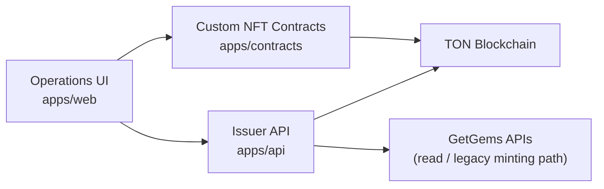
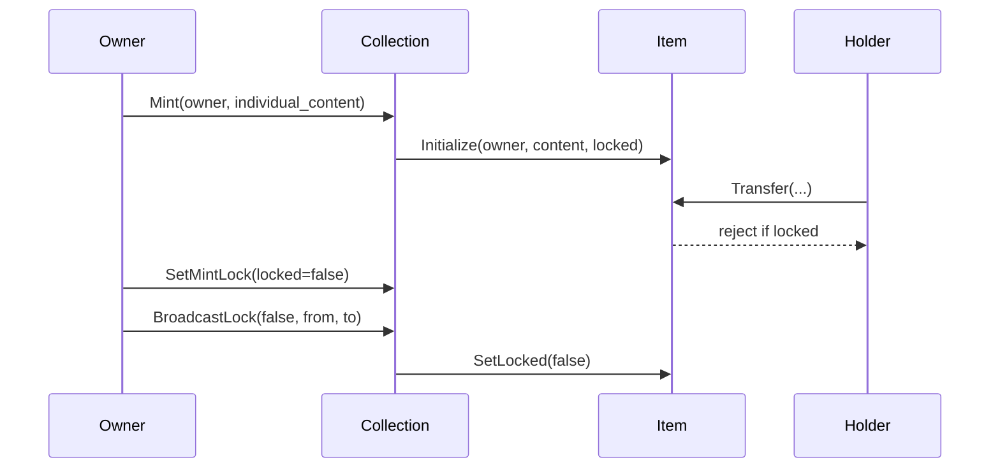

# Standard NFT + Milestone Lock Architecture

## Purpose

This document is the root-level architecture landing page for the custom TON NFT flow in this repository.

It describes how the repo is organized after the contracts were rewritten into:

- a **standard-compatible TON NFT collection/item pair**
- a **minimal milestone lock extension**

For contract-level details, see:

- [NFT_TRADING_LOCK_GUIDE.md](/Users/lake/work/tbook/ton-nft-getgems/NFT_TRADING_LOCK_GUIDE.md)

## Repository Layout

- [README.md](/Users/lake/work/tbook/ton-nft-getgems/README.md): workspace entry point
- [apps/contracts](/Users/lake/work/tbook/ton-nft-getgems/apps/contracts): TON Blueprint + Tact contracts, scripts, build artifacts, tests
- [apps/api](/Users/lake/work/tbook/ton-nft-getgems/apps/api): NestJS service layer
- [apps/web](/Users/lake/work/tbook/ton-nft-getgems/apps/web): operations UI
- [GETGEMS_MINTING_GUIDE.md](/Users/lake/work/tbook/ton-nft-getgems/GETGEMS_MINTING_GUIDE.md): existing GetGems API flow documentation
- [NFT_TRADING_LOCK_GUIDE.md](/Users/lake/work/tbook/ton-nft-getgems/NFT_TRADING_LOCK_GUIDE.md): standard NFT + lock contract behavior

## Architecture Summary

There are now two distinct tracks in the repo:

1. **Legacy / external integration track**
   The API and web apps still contain GetGems-oriented minting flows.
2. **Custom contract track**
   The contracts implement the new standard-compatible NFT architecture with milestone lock support.

The important architectural decision is that **milestone lock is implemented only in the custom contract track**.

## Contract Architecture

### Main Contracts

- [nft_collection.tact](/Users/lake/work/tbook/ton-nft-getgems/apps/contracts/contracts/nft_collection.tact)
- [nft_item.tact](/Users/lake/work/tbook/ton-nft-getgems/apps/contracts/contracts/nft_item.tact)

### Responsibility Split

- `NftCollection`
  - owns mint authority
  - stores collection metadata parts
  - stores royalty configuration
  - allows the owner to update royalty configuration after deployment
  - computes item addresses
  - deploys item contracts
  - controls milestone lock policy for future mints
  - broadcasts lock changes to existing items
- `NftItem`
  - stores ownership and individual item content
  - exposes standard item transfer/static-data behavior
  - enforces transfer lock

### Interaction Model

## Standards Coverage

The rewritten contracts aim to preserve the expected TON NFT interfaces:

- **TEP-62**
  - `get_collection_data`
  - `get_nft_address_by_index`
  - `get_nft_content`
  - `transfer`
  - `get_static_data`
  - `get_nft_data`
- **TEP-64**
  - off-chain metadata composition via collection `common_content` + item `individual_content`
- **TEP-66**
  - `royalty_params`
  - `get_royalty_params`
  - `report_royalty_params`

## Custom Extension Layer

The non-standard part is intentionally small:

- `SetMintLock`
  Controls the default lock state for **future** mints.
- `BroadcastLock`
  Applies lock changes to a range of **already deployed** items.
- `SetLocked`
  Item-level lock update message accepted only from the collection.
- `is_locked`
  Item getter for off-chain inspection.

This keeps the lock logic additive instead of replacing standard NFT behavior.

The admin-side royalty update is also additive:

- `UpdateRoyalty`
  Owner-only maintenance message that updates numerator, denominator, and destination without changing the standard read interface.

- `WithdrawTon`
  Owner-only maintenance message that withdraws excess TON from the collection while preserving a small storage reserve on-chain.

## Key Design Decisions

- **Single mint only**
  `BatchMint` was removed. Minting is now one NFT per transaction.
- **Lock at item level**
  The actual transfer guard lives in the item contract.
- **Collection controls policy**
  The collection decides default lock state for future items and can broadcast changes to old items.
- **Range-limited broadcasts**
  `BroadcastLock` is bounded per call to reduce action-list risk.
- **Basechain-only transfer guard**
  The item currently restricts transfer destinations to basechain addresses, following the common reference-contract simplification.

## Metadata Model

The collection stores two metadata cells:

- `collection_content`
  Full collection metadata reference
- `common_content`
  Shared prefix for item metadata

Each item stores:

- `individual_content`
  The item-specific suffix or payload

`get_nft_content(index, individual_content)` combines these into a TEP-64 off-chain payload.

## Operational Flows

### Deploy

Deploy the collection with:

- owner
- collection metadata content
- common item metadata prefix
- royalty numerator / denominator
- royalty destination

Reference:

- [deployNftCollection.ts](/Users/lake/work/tbook/ton-nft-getgems/apps/contracts/scripts/deployNftCollection.ts)

### Mint

- Owner sends `Mint`
- Collection deploys one item
- Item is initialized with the current `mint_locked` value

### Unlock Milestone

1. Send `SetMintLock { locked: false }`
2. Send `BroadcastLock { locked: false, from_index, to_index }` in chunks

Reference:

- [unlockTrading.ts](/Users/lake/work/tbook/ton-nft-getgems/apps/contracts/scripts/unlockTrading.ts)

### Update Royalty

- Owner sends `UpdateRoyalty`
- Collection validates the ratio and stores the new destination
- Off-chain clients continue to read the latest state through `royalty_params` / `get_royalty_params`

Reference:

- [updateRoyalty.ts](/Users/lake/work/tbook/ton-nft-getgems/apps/contracts/scripts/updateRoyalty.ts)

### Withdraw Excess TON

- Owner sends `WithdrawTon`
- Collection validates that the sender is the owner
- Collection keeps its storage reserve and transfers only the requested excess amount

Reference:

- [withdrawCollectionTon.ts](/Users/lake/work/tbook/ton-nft-getgems/apps/contracts/scripts/withdrawCollectionTon.ts)

### Re-lock

1. Send `SetMintLock { locked: true }`
2. Broadcast `SetLocked(true)` across already minted items

## Verification Assets

- [NftCollection.spec.ts](/Users/lake/work/tbook/ton-nft-getgems/apps/contracts/tests/NftCollection.spec.ts)
  Covers:
  - standard collection getters
  - royalty getter
  - royalty update flow
  - owner-only excess TON withdrawal
  - metadata composition
  - locked transfer rejection
  - unlock and successful transfer

- [apps/contracts/build/NftCollection](/Users/lake/work/tbook/ton-nft-getgems/apps/contracts/build/NftCollection)
  Generated ABI, wrappers, reports, and compiled outputs

## Current Integration Boundary

The contracts are ready as the on-chain architecture baseline, but the repo still has mixed higher-level integration paths:

- the contract track is now standard NFT + milestone lock
- the API/web track still includes GetGems-oriented minting concepts

That means the next integration step, if needed, is to make `apps/api` and `apps/web` talk directly to the custom collection messages instead of assuming GetGems minting endpoints.

## Recommended Next Step

If this custom contract path becomes the primary production path, the next repo-level alignment should be:

1. define backend endpoints around `Mint`, `SetMintLock`, `BroadcastLock`, and read getters
2. remove or isolate legacy GetGems batch-mint assumptions in the UI
3. add operator progress tracking for unlock broadcasts
