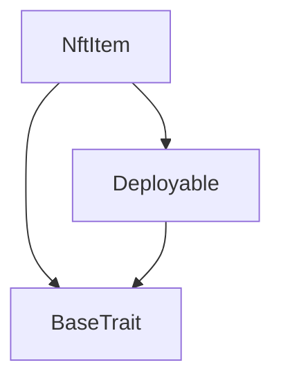
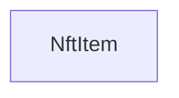

# TACT Compilation Report
Contract: NftItem
BOC Size: 1622 bytes

# Types
Total Types: 30

## StateInit
TLB: `_ code:^cell data:^cell = StateInit`
Signature: `StateInit{code:^cell,data:^cell}`

## StdAddress
TLB: `_ workchain:int8 address:uint256 = StdAddress`
Signature: `StdAddress{workchain:int8,address:uint256}`

## VarAddress
TLB: `_ workchain:int32 address:^slice = VarAddress`
Signature: `VarAddress{workchain:int32,address:^slice}`

## Context
TLB: `_ bounced:bool sender:address value:int257 raw:^slice = Context`
Signature: `Context{bounced:bool,sender:address,value:int257,raw:^slice}`

## SendParameters
TLB: `_ bounce:bool to:address value:int257 mode:int257 body:Maybe ^cell code:Maybe ^cell data:Maybe ^cell = SendParameters`
Signature: `SendParameters{bounce:bool,to:address,value:int257,mode:int257,body:Maybe ^cell,code:Maybe ^cell,data:Maybe ^cell}`

## Deploy
TLB: `deploy#946a98b6 queryId:uint64 = Deploy`
Signature: `Deploy{queryId:uint64}`

## DeployOk
TLB: `deploy_ok#aff90f57 queryId:uint64 = DeployOk`
Signature: `DeployOk{queryId:uint64}`

## FactoryDeploy
TLB: `factory_deploy#6d0ff13b queryId:uint64 cashback:address = FactoryDeploy`
Signature: `FactoryDeploy{queryId:uint64,cashback:address}`

## Transfer
TLB: `transfer#5fcc3d14 query_id:uint64 new_owner:address response_destination:address custom_payload:Maybe ^cell forward_amount:coins forward_payload:remainder<slice> = Transfer`
Signature: `Transfer{query_id:uint64,new_owner:address,response_destination:address,custom_payload:Maybe ^cell,forward_amount:coins,forward_payload:remainder<slice>}`

## OwnershipAssigned
TLB: `ownership_assigned#05138d91 query_id:uint64 prev_owner:address forward_payload:remainder<slice> = OwnershipAssigned`
Signature: `OwnershipAssigned{query_id:uint64,prev_owner:address,forward_payload:remainder<slice>}`

## Excesses
TLB: `excesses#d53276db query_id:uint64 = Excesses`
Signature: `Excesses{query_id:uint64}`

## GetStaticData
TLB: `get_static_data#2fcb26a2 query_id:uint64 = GetStaticData`
Signature: `GetStaticData{query_id:uint64}`

## OwnershipChanged
TLB: `ownership_changed#3a4d7e91 index:uint64 prev_owner:address new_owner:address = OwnershipChanged`
Signature: `OwnershipChanged{index:uint64,prev_owner:address,new_owner:address}`

## ItemInitialized
TLB: `item_initialized#0f0a6d5c index:uint64 = ItemInitialized`
Signature: `ItemInitialized{index:uint64}`

## ReportStaticData
TLB: `report_static_data#8b771735 query_id:uint64 index:uint256 collection_address:address = ReportStaticData`
Signature: `ReportStaticData{query_id:uint64,index:uint256,collection_address:address}`

## Initialize
TLB: `initialize#fe8b8455 owner:address content:^cell locked:bool = Initialize`
Signature: `Initialize{owner:address,content:^cell,locked:bool}`

## SetLocked
TLB: `set_locked#1d4c0e4a locked:bool = SetLocked`
Signature: `SetLocked{locked:bool}`

## NftData
TLB: `_ init:bool index:int257 collection_address:address owner_address:Maybe address content:Maybe ^cell = NftData`
Signature: `NftData{init:bool,index:int257,collection_address:address,owner_address:Maybe address,content:Maybe ^cell}`

## NftItem$Data
TLB: `null`
Signature: `null`

## Mint
TLB: `mint#f57f638d owner:address content:^cell = Mint`
Signature: `Mint{owner:address,content:^cell}`

## SetMintLock
TLB: `set_mint_lock#2a3b4c5d locked:bool = SetMintLock`
Signature: `SetMintLock{locked:bool}`

## BroadcastLock
TLB: `broadcast_lock#3e4f5a6b locked:bool from_index:uint64 to_index:uint64 = BroadcastLock`
Signature: `BroadcastLock{locked:bool,from_index:uint64,to_index:uint64}`

## GetRoyaltyParams
TLB: `get_royalty_params#693d3950 query_id:uint64 = GetRoyaltyParams`
Signature: `GetRoyaltyParams{query_id:uint64}`

## ReportRoyaltyParams
TLB: `report_royalty_params#a8cb00ad query_id:uint64 numerator:uint16 denominator:uint16 destination:address = ReportRoyaltyParams`
Signature: `ReportRoyaltyParams{query_id:uint64,numerator:uint16,denominator:uint16,destination:address}`

## UpdateRoyalty
TLB: `update_royalty#6f89f5e3 numerator:uint16 denominator:uint16 destination:address = UpdateRoyalty`
Signature: `UpdateRoyalty{numerator:uint16,denominator:uint16,destination:address}`

## WithdrawTon
TLB: `withdraw_ton#08f34d6f amount:coins destination:address = WithdrawTon`
Signature: `WithdrawTon{amount:coins,destination:address}`

## CollectionData
TLB: `_ next_item_index:int257 collection_content:^cell owner_address:address = CollectionData`
Signature: `CollectionData{next_item_index:int257,collection_content:^cell,owner_address:address}`

## RoyaltyParams
TLB: `_ numerator:uint16 denominator:uint16 destination:address = RoyaltyParams`
Signature: `RoyaltyParams{numerator:uint16,denominator:uint16,destination:address}`

## BroadcastFailureState
TLB: `_ failure_count:int257 last_failed_address:Maybe address = BroadcastFailureState`
Signature: `BroadcastFailureState{failure_count:int257,last_failed_address:Maybe address}`

## NftCollection$Data
TLB: `null`
Signature: `null`

# Get Methods
Total Get Methods: 2

## get_nft_data

## is_locked

# Error Codes
2: Stack underflow
3: Stack overflow
4: Integer overflow
5: Integer out of expected range
6: Invalid opcode
7: Type check error
8: Cell overflow
9: Cell underflow
10: Dictionary error
11: 'Unknown' error
12: Fatal error
13: Out of gas error
14: Virtualization error
32: Action list is invalid
33: Action list is too long
34: Action is invalid or not supported
35: Invalid source address in outbound message
36: Invalid destination address in outbound message
37: Not enough TON
38: Not enough extra-currencies
39: Outbound message does not fit into a cell after rewriting
40: Cannot process a message
41: Library reference is null
42: Library change action error
43: Exceeded maximum number of cells in the library or the maximum depth of the Merkle tree
50: Account state size exceeded limits
128: Null reference exception
129: Invalid serialization prefix
130: Invalid incoming message
131: Constraints error
132: Access denied
133: Contract stopped
134: Invalid argument
135: Code of a contract was not found
136: Invalid address
137: Masterchain support is not enabled for this contract
2977: Already initialized
4055: Only item can confirm mint
4420: Only owner can update royalty
6803: Only owner can withdraw TON
7657: Not initialized
8291: Transfer query_id must be increasing
12308: Only collection can initialize
14760: Invalid royalty denominator
19314: Unexpected mint index
27983: Trading is locked for this item
28049: No withdrawable TON available
33847: Withdraw amount must be positive
33977: Withdraw amount exceeds available TON
36952: Only owner can transfer
40129: Only item can notify ownership change
40282: Invalid range
40609: No minted items to broadcast
41880: Range too large
42377: Insufficient value for transfer
44504: Mint already in progress
47098: Only collection can change lock status
54045: Only owner can broadcast
54169: Invalid royalty ratio
55650: Only basechain addresses supported
57579: Only owner can mint
59449: Invalid item index
59800: No mint in progress
60814: Range exceeds minted items
62399: Only owner can set mint lock

# Trait Inheritance Diagram

# Contract Dependency Diagram

